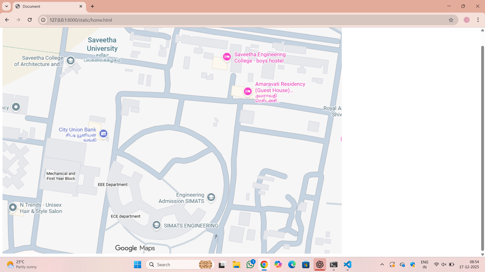
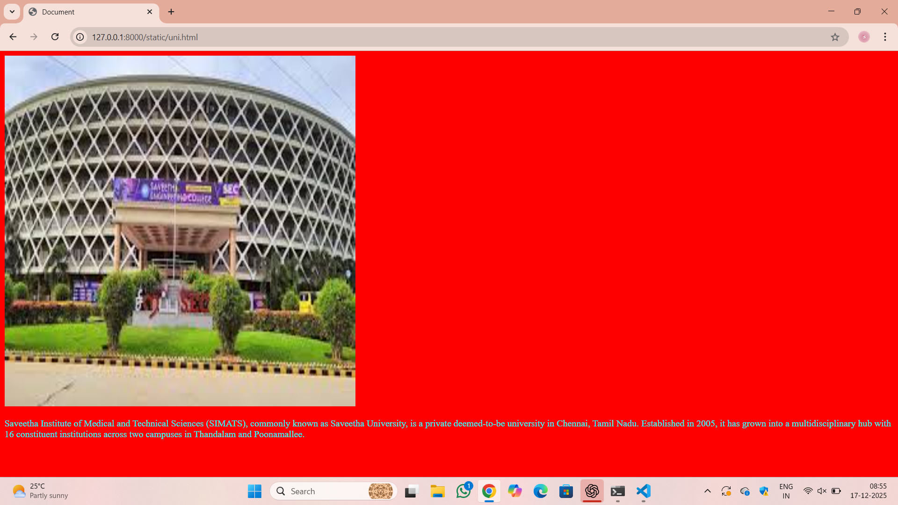
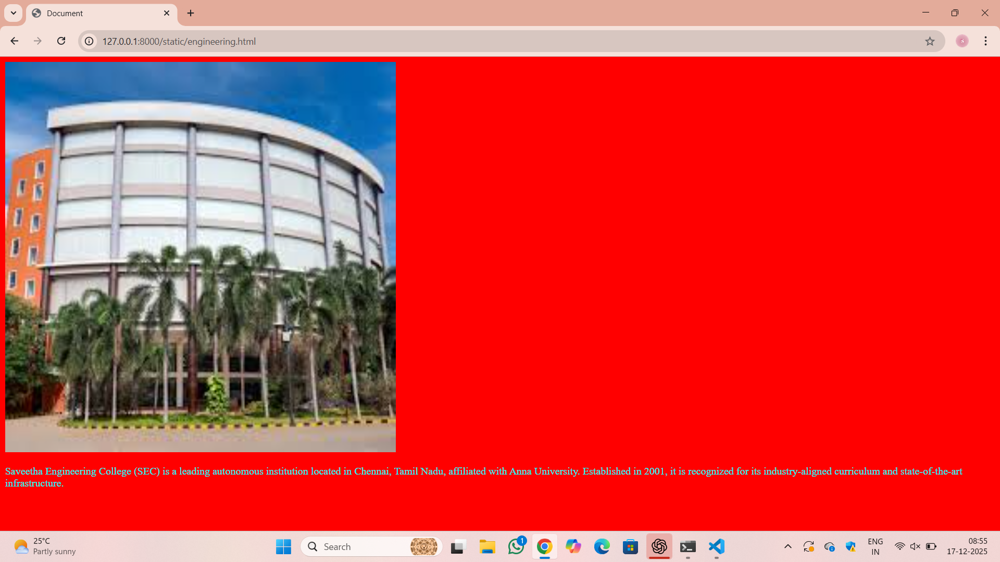
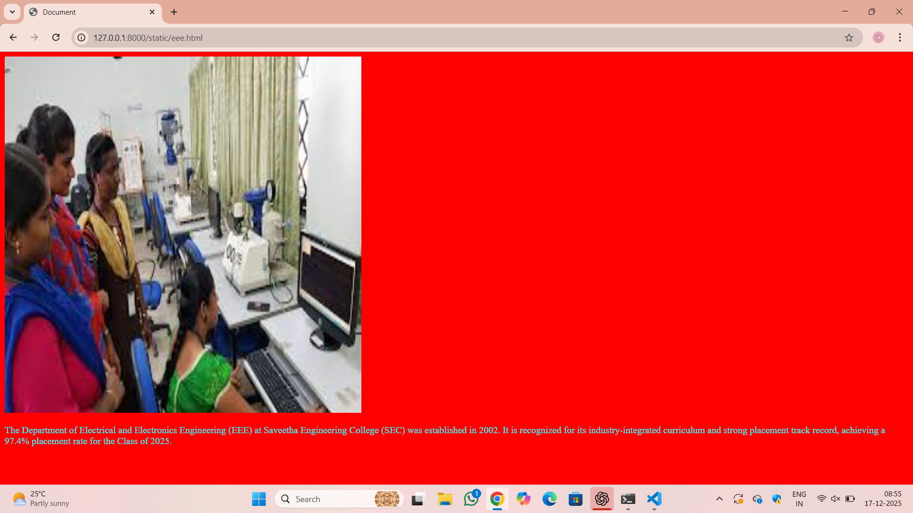

# Ex04 Places Around Me
## Date: 17/12/2025

## AIM
To develop a website to display details about the places around my house.

## DESIGN STEPS

### STEP 1
Create a Django admin interface.

### STEP 2
Download your city map from Google.

### STEP 3
Using ```<map>``` tag name the map.

### STEP 4
Create clickable regions in the image using ```<area>``` tag.

### STEP 5
Write HTML programs for all the regions identified.

### STEP 6
Execute the programs and publish them.

## CODE
```
home.html
<!DOCTYPE html>
<html lang="en">
<head>
    <meta charset="UTF-8">
    <meta name="viewport" content="width=device-width, initial-scale=1.0">
    <title>Document</title>
</head>
<body>
    <!-- Image Map Generated by http://www.image-map.net/ -->


<map name="image-map">
    <area target="" alt="engineering" title="engineering" href="engineering.html" coords="442,644,552,690" shape="rect">
    <area target="" alt="eee department" title="eee department" href="eee.html" coords="354,529,35" shape="circle">
    <area target="" alt="sec uni" title="sec uni" href="uni.html" coords="189,154,244,211,354,181,401,46,324,0,235,3,196,61,174,111" shape="poly">
</map>
</body>
</html>
engineering.html
<!DOCTYPE html>
<html lang="en">
<head>
    <meta charset="UTF-8">
    <meta name="viewport" content="width=device-width, initial-scale=1.0">
    <title>Document</title>
</head>
<body bgcolor="red" text="cyan">
    
    <p>Saveetha Engineering College (SEC) is a leading autonomous institution located in Chennai, Tamil Nadu, affiliated with Anna University. Established in 2001, it is recognized for its industry-aligned curriculum and state-of-the-art infrastructure. </p>
</body>
</html>
uni.html
<!DOCTYPE html>
<html lang="en">
<head>
    <meta charset="UTF-8">
    <meta name="viewport" content="width=device-width, initial-scale=1.0">
    <title>Document</title>
</head>
<body bgcolor="red" text="cyan">
    
    <p>Saveetha Institute of Medical and Technical Sciences (SIMATS), commonly known as Saveetha University, is a private deemed-to-be university in Chennai, Tamil Nadu. Established in 2005, it has grown into a multidisciplinary hub with 16 constituent institutions across two campuses in Thandalam and Poonamallee. </p>
</body>
</html>
eee.html
<!DOCTYPE html>
<html lang="en">
<head>
    <meta charset="UTF-8">
    <meta name="viewport" content="width=device-width, initial-scale=1.0">
    <title>Document</title>
</head>
<body bgcolor="red" text="cyan">
    
    <p>The Department of Electrical and Electronics Engineering (EEE) at Saveetha Engineering College (SEC) was established in 2002. It is recognized for its industry-integrated curriculum and strong placement track record, achieving a 97.4% placement rate for the Class of 2025. </p>
</body>
</html>
```

## OUTPUT






## RESULT
The program for implementing image maps using HTML is executed successfully.
